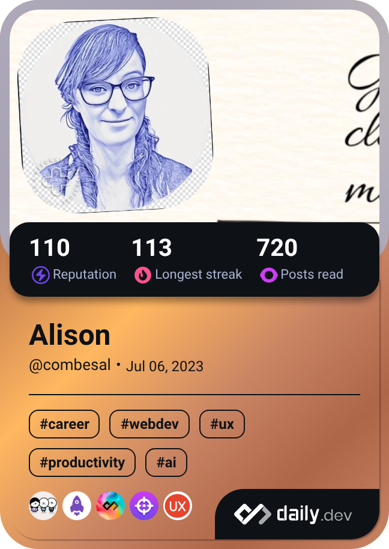

---

📘 *Documentation isn’t a side note. It’s how your product speaks.*

---

# Hi there 👋

## I'm a freelance technical writer who makes complex tools easier to understand.

✍️ I specialize in clear, user-focused documentation, including user guides, onboarding content, developer docs, and internal tools.

💡 With a background in translation, web development, and IT support, I bring a cross-disciplinary perspective to every project. I aim to make information clear, consistent, and accessible, especially for global and non-native English-speaking audiences.

- 🔧 **Documentation Tools:** Markdown, Git/GitHub, Docusaurus, Confluence, Notion, Microsoft Word, Google Docs
- 🗂️ **Content Types:** Docs audits, developer guides, API docs, user documentation, knowledge bases, FAQs
- 💻 **Technical Skills:** HTML, CSS, JavaScript, PHP, REST APIs, JSON, XML, Bash
- 🧩 **Methods:** Docs-as-code, information architecture, style guides, Agile/Scrum
- 🌍 **Languages:** English (native), French (C2)

Wondering if your docs could be improved?  
📅 <a href="https://calendly.com/alison-combes/connect" target="_blank">Let’s talk</a>

## Continuous learning
You can discover more about the articles I'm reading right now by clicking on my daily.dev card below 👇

 
  

