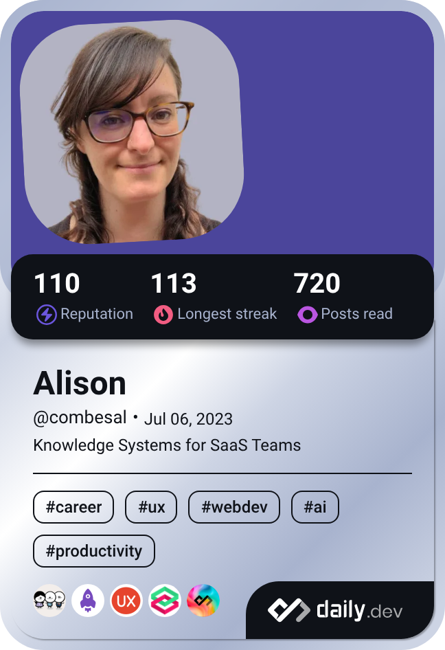

*When SaaS teams scale fast, knowledge rarely keeps up.*
---

## Hi there

I help SaaS teams structure their knowledge so onboarding is faster, 
support load decreases, and work stops depending on who's available.

Background in web development, IT support, and translation.  
I work at the intersection of product, support, and documentation 
for international teams.

**What I work on**
- Knowledge audits and information architecture
- Onboarding and feature documentation
- API and developer documentation
- Ongoing knowledge support for fast-moving teams

**Tools**  
Markdown, Git, Docusaurus, Confluence, Notion, GitHub  
HTML, CSS, JavaScript, REST APIs

**Languages:**  
English (native) · French (fluent - C2)

📅 <a href="https://calendly.com/alison-combes/connect" target="_blank">Book a call</a>  
🌐 <a href="https://combesal.github.io/" target="_blank">Portfolio</a>

---

## Currently reading

 
  

