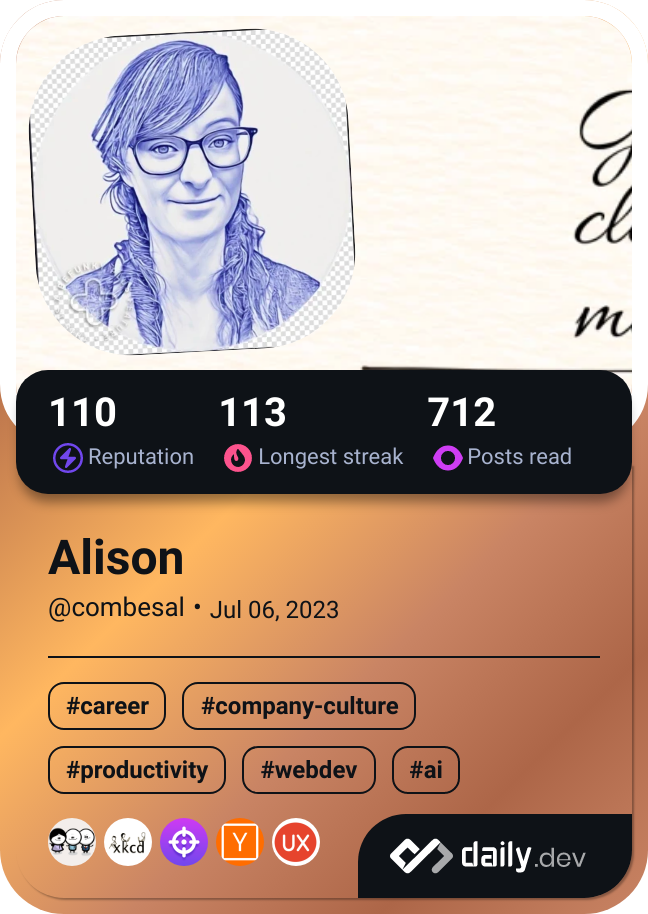

# Hi there 👋

## I'm a freelance technical writer who makes complex tools easier to understand.

✍️ I specialize in clear, user-focused documentation, including user guides, onboarding content, developer docs, and internal tools.

💡 With a background in translation, web development, and IT support, I bring a cross-disciplinary perspective to every project. I aim to make information clear, consistent, and accessible, especially for global and non-native English-speaking audiences.

🔧 Tools: Jira, Confluence, Git, Google Docs, CMS platforms, HTML/CSS, JavaScript basics  
🌍 Languages: native English, fluent French

---

📘 *Documentation isn’t a side note. It’s how your product speaks.*

---

## Continuous learning
You can discover more about the articles I'm reading right now by clicking on my daily.dev card below 👇

 
  <a href="https://app.daily.dev/combesal" target="_blank">
    

